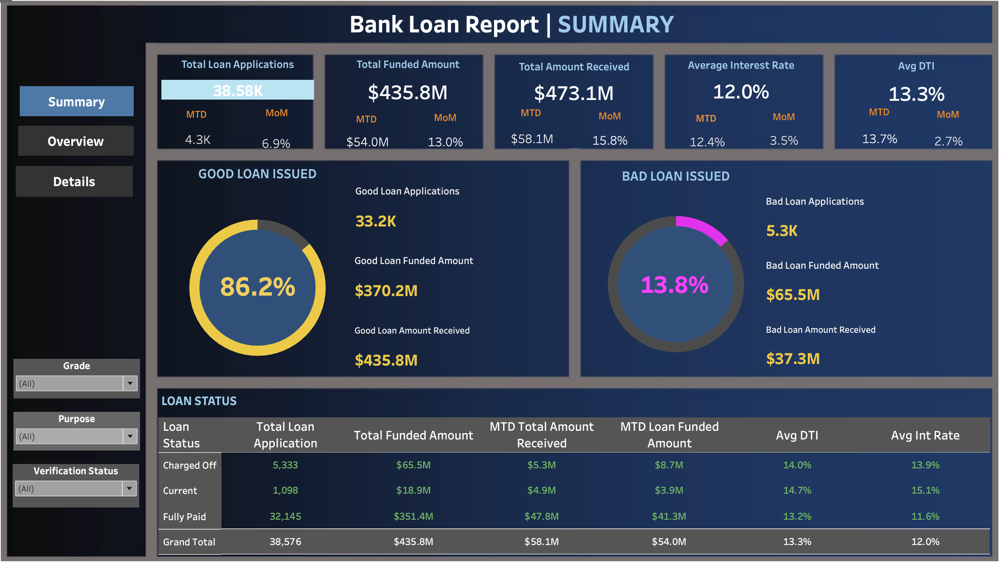
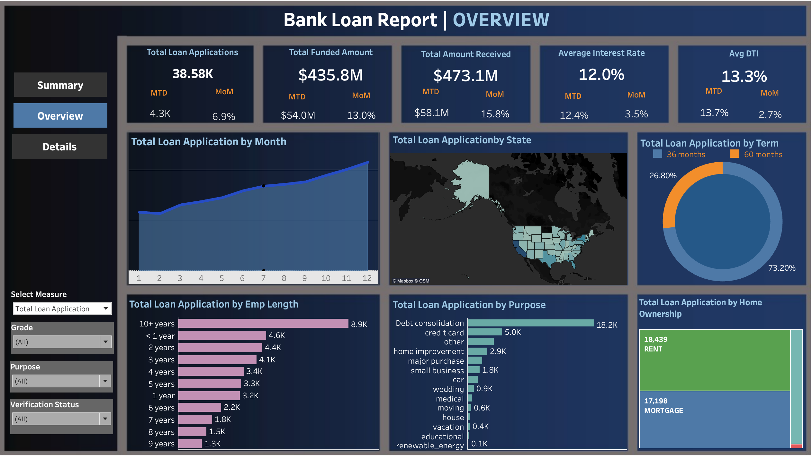

# 🏦 Bank Loan Report  

## 📌 Table of Contents  
- [Overview](#overview)  
- [Dataset](#dataset)  
- [Problem Statement](#problem-statement)  
- [Tableau Dashboard](#tableau-dashboard)  
- [Key Performance Indicators (KPIs)](#key-performance-indicators-kpis)  
- [SQL Queries](#sql-queries)  
- [Expected Outcomes](#expected-outcomes)  
- [Recommendations](#recommendations)  
- [Tools Used](#tools-used)  

---

## 📊 Overview  

The **Bank Loan Report** is designed to monitor and assess **lending activities and performance**. This report provides insights into **loan applications, funding amounts, interest rates, debt-to-income ratios, and loan statuses**. It enables data-driven decision-making by analyzing **trends, borrower behavior, and loan health**.

📌 **Key Insights:**  
- Track **total loan applications**, **funded amounts**, and **repayments**.  
- Identify **loan trends** based on region, term, and borrower profile.  
- Distinguish between **Good Loans (Fully Paid, Current)** and **Bad Loans (Charged Off)**.  
- Assess borrower **employment length, homeownership, and loan purpose**.  

---

## 📂 Dataset  

📥 **Download Data**: [`financial_loan.csv`](./financial_loan.csv)  

**Columns Include:**  
- `Id` – Unique loan identifier  
- `Purpose` – Reason for loan (Debt Consolidation, Credit Card, etc.)  
- `Home_Ownership` – Borrower’s home status (Rent, Mortgage, Own)  
- `Grade` – Loan grading system  
- `Issue_Date` – Date the loan was issued  
- `Installment` – Monthly installment amount  
- `Interest_Rate` – Loan interest rate  
- `Loan_Amount` – Loan principal amount  
- `Total_Payment` – Total repayment amount  

---

## ❓ Problem Statement  

Banks and financial institutions issue loans to borrowers for various purposes such as **debt consolidation, home improvement, medical expenses, and small businesses**. However, managing loan portfolios and minimizing **default risk** is a major challenge.  

📌 **Key Problems:**  
- How can we **identify high-risk borrowers** before loan approval?  
- What factors influence **loan repayment success** and **default rates**?  
- Which loan purposes have the **highest risk of default**?  
- How do **homeownership, employment length, and income level** affect loan performance?  
- How can banks **optimize loan approval processes** and **improve overall profitability**?  

By analyzing past loan data, this project aims to provide **actionable insights** that help financial institutions **improve lending decisions, reduce defaults, and increase loan recovery rates**.

---

## 📊 Tableau Dashboard  

### **Summary Dashboard**  
📊 Provides an overview of **loan performance**, including **good vs. bad loans** and **loan status breakdown**.  
  

### **Overview Dashboard**  
📍 Displays **loan trends by month, region, term, employment length, and purpose**.  
  

### **Details Dashboard**  
📋 Presents a **detailed loan dataset**, allowing users to filter by **purpose, grade, and verification status**.  
  

---

## 📈 Key Performance Indicators (KPIs)  

### **Loan Portfolio Metrics**  
- **Total Loan Applications** 📊  
- **Total Funded Amount** 💰  
- **Total Amount Received** ✅  
- **Average Interest Rate** 📉  
- **Average Debt-to-Income Ratio (DTI)**  

### **Good Loan vs. Bad Loan KPIs**  
✔ **Good Loans** (Fully Paid, Current)  
❌ **Bad Loans** (Charged Off)  

✔ **Good Loan Funded Amount vs. Received Amount**  
❌ **Bad Loan Funded Amount vs. Received Amount**  

✔ **Good Loan Application Percentage**  
❌ **Bad Loan Application Percentage**  

---

## 💾 SQL Queries  

## 💾 Key SQL Queries  

### **1️⃣ Total Loan Applications & Funded Amount**  
```sql
SELECT COUNT(id) AS Total_Loan_Applications FROM BankLoanDB.financial_loan;
SELECT SUM(loan_amount) AS Total_Funded_Amount FROM BankLoanDB.financial_loan;
```
📌 Insight: Tracks the total number of loans issued and total capital allocated.

### 2️⃣ Loan Trends by Month
```sql
SELECT MONTH(issue_date) AS Month, COUNT(id) AS Total_Applications 
FROM BankLoanDB.financial_loan 
GROUP BY Month 
ORDER BY Month;
```
📌 Insight: Helps analyze monthly loan application trends to spot seasonal demand.

### 3️⃣ Good vs. Bad Loan Percentage
```sql
SELECT  
    ROUND((COUNT(CASE WHEN loan_status IN ('Fully Paid', 'Current') THEN id END) * 100.0) / COUNT(id)) 
    AS Good_Loan_Percentage,
    ROUND((COUNT(CASE WHEN loan_status = 'Charged Off' THEN id END) * 100.0) / COUNT(id)) 
    AS Bad_Loan_Percentage
FROM BankLoanDB.financial_loan;
```
📌 Insight: Measures successful vs. defaulted loans to assess risk.

### 4️⃣ Loan Status by State
```sql
SELECT address_state, COUNT(id) AS Total_Applications, SUM(loan_amount) AS Loan_Amount 
FROM BankLoanDB.financial_loan 
GROUP BY address_state
ORDER BY Loan_Amount DESC;
```
📌 Insight: Identifies which states have the highest loan demand and funding.

### 5️⃣ Loan Status by Purpose
```sql
SELECT purpose, COUNT(id) AS Total_Applications, SUM(loan_amount) AS Loan_Amount 
FROM BankLoanDB.financial_loan 
GROUP BY purpose
ORDER BY Total_Applications DESC;
```
📌 Insight: Determines the most common loan purposes and their financial impact.

## 🎯 Expected Outcomes  

✔ **Understand loan trends** based on **monthly applications, funding, and repayments**.  
✔ **Identify high-risk loans** by analyzing **interest rates, DTI, and repayment behavior**.  
✔ **Optimize lending decisions** using **Good Loan vs. Bad Loan classification**.  
✔ **Improve marketing strategies** based on **loan purpose and borrower demographics**.  

---

## 🔹 Recommendations  

### 📌 **Reduce Loan Default Risk**  
- Stricter **eligibility criteria** for high-risk borrowers.  
- Improve **loan collection processes** to minimize defaults.  

### 📌 **Increase Loan Approvals for Low-Risk Borrowers**  
- Target **good credit score applicants** with **lower interest rates**.  
- Offer **incentives for early repayments** to improve cash flow.  

### 📌 **Optimize Loan Marketing Strategies**  
- Promote loans **based on borrower needs** *(Debt Consolidation, Home Improvement)*.  
- Use **regional analysis** to identify **high-loan-demand states**.
- 
## 🛠 Tools Used  

- **MySQL** – Data storage, queries, and trend analysis  
- **Tableau** – Interactive dashboard visualization  
- **Excel** – Data cleaning and preprocessing  


